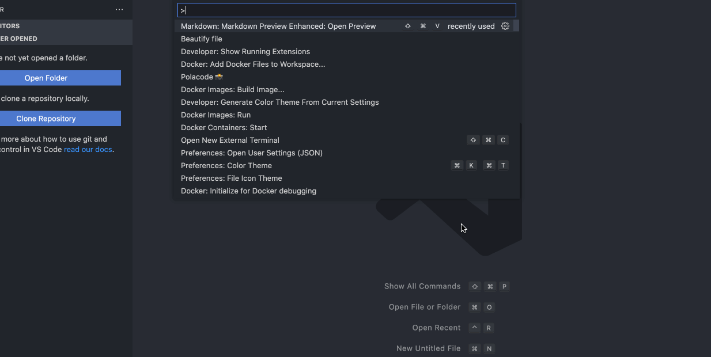
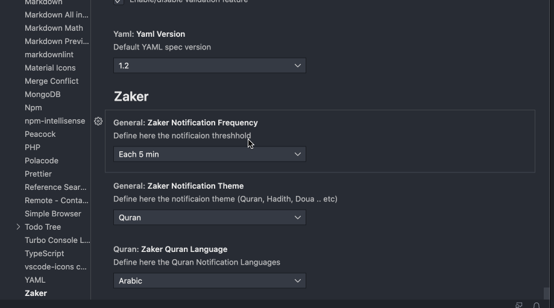

# Zaker

Zaker is a the Muslim developer everyday automated reminder helper tool, the extension will remind you to read Two verse from randomly selected Chapter, Profit's Hadith (Soon) or a Doua (Soon)

## Features

### Show Aya Command

### Comprehensive Setting Page

In this setting page you can set the reminders `Frequency` `Quran Language` `Reminder type (Quran for now)`

## Extension Settings

This extension contributes the following settings:

* `Zaker.general.zakerNotificationTheme`: Set to `Zaker` reminder theme (Quran only for v1).
* `Zaker.general.zakerNotificationFrequency`: Set to `Zaker` reminder Frequency.
* `Zaker.quran.zakerQuranLanguage`: Set to `Zaker` Quran Fetch Language.

## Release Notes

### 1.0.0

Initial release of Zaker ...

---

## For more information

* [Houssam Yahiaoui LinkedIn](https://www.linkedin.com/in/houssemyahiaoui/)

**Enjoy!**
